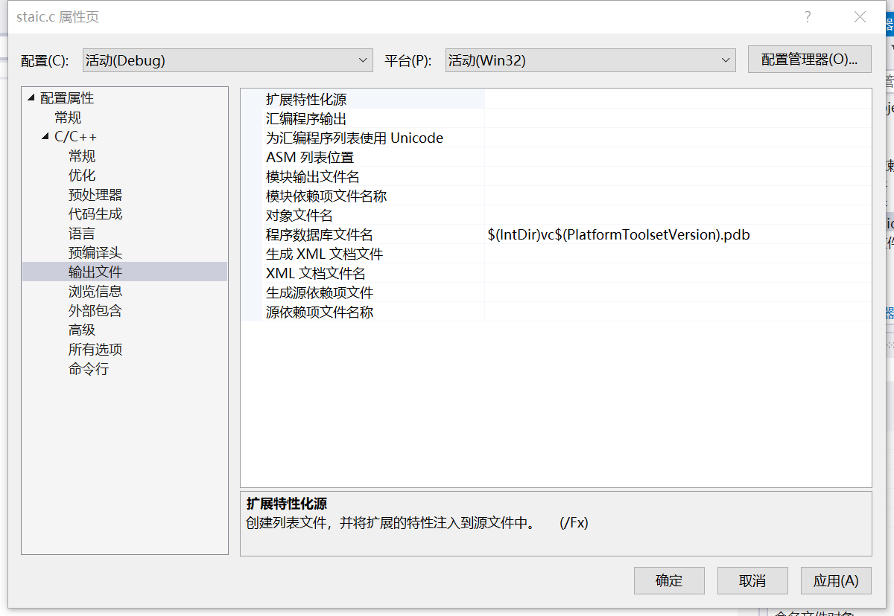
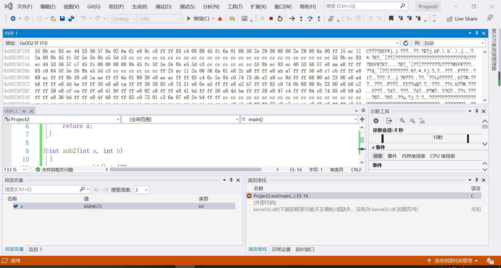

## 作业一

##### 1、在vs中建立工程，修改编译选项，只保留 /ZI （调试）和pdb文件路径两个选项，增加禁用安全检查选项（/GS-)。

##### 2、编译多个函数调用的示例代码。

##### 3、下断点调试运行，观察反汇编、寄存器、内存等几个调试时的信息。

##### 4、分析函数调用过程中栈的变化。解释什么是栈帧？ebp寄存器在函数调用过程中的变化过程，ebp寄存器的作用。

每个栈帧对应着一个未运行完的函数。栈帧中保存了该函数的返回地址和局部变量。栈帧也叫过程活动记录，是编译器用来实现过程/函数调用的一种数据结构。

每个函数的每次调用，都有它自己独立的一个栈帧，这个栈帧中维持着所需要的各种信息。寄存器ebp指向当前的栈帧的底部(高地址)，寄存器esp指向当前的栈帧的顶部(低地址)。EBP指向当前位于系统栈最上边一个栈帧的底部，而不是系统栈的底部。

EBP寄存器的作用：EBP存储着当前函数栈底的地址，栈低通常作为基址，我们可以通过栈底地址和偏移相加减来获取变量地址。

##### 5、函数局部变量和参数的保存位置、访问方式是什么。

局部变量也称为内部变量。局部变量是在函数内作定义说明的。其作用域仅限于函数内，离开该函数后再使用这种变量是非法的。局部变量没有默认值，如果要想使用，必须手动赋值。局部变量内存的位置：位于栈内存；局部变量是通过栈偏移量直接访问的，函数返回时该函数的整个栈空间被回收。

形参出现在函数定义中，在整个函数体内都可以使用，离开该函数则不能使用。实参出现在主调函数中，进入被调函数后，实参变量也不能使用。形参和实参的功能是作数据传送，发生函数调用时，主调函数把实参的值传送给被调函数的形参从而实现主调函数向被调函数的数据传送。

##### 6、多层的函数调用，栈的变化情况，解释未赋初始值的局部变量的值是如何形成的。

1.调用者在自己的栈帧里开辟好被调函数形参需要的空间

2.入栈 函数调用结束后应该执行的地址值，即返回地址，其实就是回收第一步为形参开辟的空间的指令的地址

3.进入被调函数了，入栈调用函数栈帧的栈底地址

4.在新函数的当前栈帧内为局部变量分配空间后，入栈局部变量

5.被调函数遇到return语句了，说明即将结束本函数了，就开始做回收本栈帧的空间的事了：

    1）如果有返回值，那么把返回值赋值给EAX，如果没有则忽略这一步。

    2）回收局部变量空间，即esp指向调用函数栈帧的栈顶了

    3）提前存好的main函数栈帧的栈底地址赋值进入ebp寄存器，从而使得ebp指向main函数栈帧的栈底

    4）把返回地址填入EIP寄存器，接着就会指向，回收main函数当初为被调函数开辟的两个形参的空间的指令地址

    5）回收形参空间

内存地址不断被不同的程序重复使用，程序使用了这个地址会在这个地址上存储数据，当程序结束时，数据不会立即清除，只是程序放弃这个地址。你定义一个变量，计算机分配地址，正好分配到这个地址上，但没有初始化变量，即没有刷新这个地址上的已有数据，当直接使用这个变量时，取到的值就是之前程序储存在这个地址上的值。